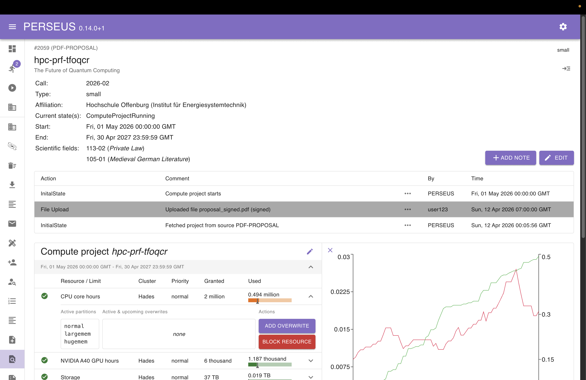

    

        
    

    

        
        
    

    

        <a href="https://perseus-project.pc2.uni-paderborn.de/docs/">Documentation</a> 
        <a href="https://perseus-project.pc2.uni-paderborn.de/preview/">Live demo</a> 
        <a href="https://perseus-project.pc2.uni-paderborn.de/contact/">Contact</a> 
        <a href="https://github.com/pc2-perseus/perseus-plugins">Available plugins</a>
    

## What is PERSEUS?

> PERSEUS is currently in beta. Some features are still experimental and maybe don't work as expected.
> Feel free to reach out to us and share you experiences and feedback: https://perseus-project.pc2.uni-paderborn.de/contact/

PERSEUS is a compute project management software for scientific HPC centers. It allows you to
* professionalize your workflows
* deploy center-wide automation
* fully customize workflow items (states), (micro)services and reports

Here’s a first look at the software:

## What's new?

<!-- CHANGELOG START -->
Version **0.15.0** includes the following updates:

### PERSEUS

- _Added_
  - New endpoint providing an overview of compute projects with usage data, including recent job counts and pending/running jobs
  - Indicator colors for resource priorities
  - Group job support across the job manager and frontend
  - Extended resource data model with parent hierarchy, default partitions, trackable resources, and minimum, maximum, and default values
  - Updated resource manager frontend to support the new resource fields when creating or editing resources
  - New endpoint allowing users to update their email address
  - Isolated MongoDB test environments using TestContainers for deterministic, self-contained test runs
- _Fixed_
  - Resource values are now visible and editable in the project editor when the browser window is narrow
  - Phase date rows in "All resources & limits" can now be expanded by clicking the row, matching the behavior of compute project entries
  - Requests authenticated via the `Perseus-Token` header are now correctly resolved for identity-dependent service logic instead of being silently treated as unauthenticated

### Andromeda

- _Added_
  - Redesigned "My Projects" page
  - Email address update in the profile section with validation that rejects common private email providers
  - Group job display in job tables
- _Changed_
  - Updated npm dependencies to latest versions and upgraded Node to version 24 LTS

### Gateway

- _Added_
  - Added the frontend configuration endpoint to the list of allowed endpoints
- _Fixed_
  - Login no longer fails when a user's username is not set
<!-- CHANGELOG END -->

<a href="https://perseus-project.pc2.uni-paderborn.de/changelog/">Click here to view the complete changelog</a>.

## Getting Started

There are multiple ways to run PERSEUS.
You can either use our automated installer scripts or deploy it manually using Docker or Podman.

### Installer & Updater

If you prefer an automated setup that installs all dependencies and configures the environment for you, we provide installer scripts that set up **Docker or Podman**, along with **Nginx** and required configuration files.

Compared to the manual `docker-compose` approach, the installer scripts offer a **more opinionated**, out-of-the-box experience – ideal for quick testing, small-scale deployments, or first-time users.

We currently offer two variants:

* [`installer-docker.sh`](https://github.com/pc2-perseus/perseus/blob/main/installer-docker.sh) – for Docker-based setups (requires root)
* [`installer-podman.sh`](https://github.com/pc2-perseus/perseus/blob/main/installer-podman.sh) – for Podman-based setups (runs containers as a dedicated non-root user)

> The scripts support most major Linux distributions and will automatically detect your package manager.

To keep your deployment up to date, we also provide:

* [`updater-docker.sh`](https://github.com/pc2-perseus/perseus/blob/main/updater-docker.sh)
* [`updater-podman.sh`](https://github.com/pc2-perseus/perseus/blob/main/updater-podman.sh)

These update scripts stop the running containers, pull the latest images, restart the services, and clean up unused resources.

📖 Read more about the installer workflow in our
[**official documentation**](https://perseus-project.pc2.uni-paderborn.de/installation/use_install_script/)

### Run via Docker

We also provide a ready-to-use [`docker-compose.yml`](https://github.com/pc2-perseus/perseus/blob/main/docker-compose.yml) to run PERSEUS using **Docker** or **Podman**.

Our prebuilt container images are available on [Docker Hub](https://hub.docker.com/u/pc2upb).

> ⚠️ Note: This approach requires you to set up a reverse proxy (e.g. Nginx, Traefik, or Caddy) yourself to route requests to the frontend and backend containers. We recommend serving the API under '/api' and the frontend at '/'.

📖 To learn more about this installation method, visit the [official documentation](https://perseus-project.pc2.uni-paderborn.de/installation/use_docker-compose/).

## Components

PERSEUS comes with the following components:
* [PERSEUS core](https://github.com/pc2-perseus/perseus-core)
* [PERSEUS frontend](https://github.com/pc2-perseus/perseus-frontend)
* [PERSEUS worker](https://github.com/pc2-perseus/perseus-worker)
* [Plugins](https://github.com/pc2-perseus/perseus-plugins) (states, services & reports)

## License

This project is licensed under the terms of the **MIT License**.
See the [LICENSE](https://github.com/pc2-perseus/perseus/blob/main/LICENSE) file for details.
